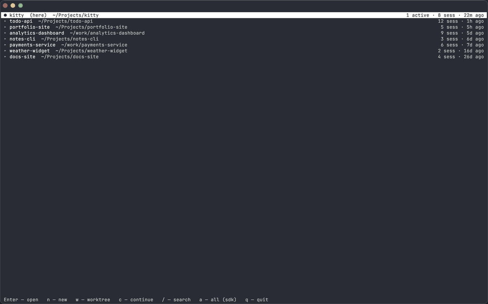

# familiar

Клавиатурные оверлеи для терминала [kitty](https://sw.kovidgoyal.net/kitty/),
выстроенные вокруг работы с Claude Code — менеджер сессий для твоих ИИ-агентов,
ревьювер незакоммиченных правок git и просмотрщик истории/диффов git. Чистый
Python (stdlib) плюс Pygments для подсветки синтаксиса — он лежит рядом,
в `plugins/vendor`, ставить нечего. Только macOS.

> *Familiar* — дух-помощник в облике кошки; в самый раз для набора kitty-китов,
> которые присматривают за твоими кодинг-агентами.

[English](README.md) · [Русский](README.ru.md)

Каждый кит — полноэкранный оверлей, открывается по хоткею:

| Кит | Хоткей | Что делает |
|---|---|---|
| [session](docs/ru/session.md) | `Cmd+Shift+S` | Просмотр и управление сессиями Claude Code — resume, fork, continue, новая сессия, git worktree, предпросмотр диалога транскриптом (с вызовами инструментов и их выводом), переименование и реальная активность (какие сессии запущены прямо сейчас). |
| [review](docs/ru/review.md) | `Cmd+Shift+R` | Двухпанельный ревьювер незакоммиченных правок git: дерево файлов + unified diff с подсветкой синтаксиса, word-diff, поиск, прыжки по изменениям, git add из дерева и построчные замечания, собираемые в markdown для вставки обратно в Claude. |
| [log](docs/ru/log.md) | `Cmd+Shift+L` | Просмотр истории git: список коммитов с графом веток, по коммиту — двухпанельный diff (тот же движок, что у `review`), `git fetch` и копирование hash / `@путь` / `@путь#L42` для промта Claude Code. |

Полные раскладки клавиш — в подробной документации по каждому киту в [`docs/ru/`](docs/ru/).

## Требования

- **macOS.** Хоткеи на `Cmd`, «open in editor» у `review` запускает
  macOS-приложения IDE, а вложенный [конфиг](config/README.ru.md) использует
  macOS-only опции kitty. На Linux/Windows `Cmd` пришлось бы переназначить на
  `Ctrl`/`Super`.
- **kitty** — проверялось на 0.47.
- **git** — нужен для `review` и `log` (вызывают `git` через subprocess).
- **Claude Code** — нужен только для `session`; он читает `~/.claude`
  (учитывает `CLAUDE_CONFIG_DIR`).
- **Внешних Python-зависимостей нет** — киты исполняются встроенным в kitty
  Python и используют только стандартную библиотеку.

## Демо



## Установка

Хелпер `familiar` сам всё подключает: пишет `include` в твой `kitty.conf` и
генерирует kitten-мапы с **абсолютными** путями (относительный путь kitty резолвит от
`~/.config/kitty`, а не от файла с `map` — просто относительным не обойтись).
Никакой ручной правки, никакого `sed`, и это переживает обновления.

### Homebrew (рекомендую)

```sh
brew tap denoby/familiar https://github.com/DenoBY/familiar
brew install denoby/familiar/familiar   # полное имя = доверие только этой формуле
familiar enable --all                    # киты + мой конфиг терминала
```

Полное имя `denoby/familiar/familiar` требует Tap Trust из Homebrew 6.0+: сторонние
tap не загружаются, пока им не доверишь, а установка по полному имени доверяет
только этой формуле. Как альтернатива — один раз доверить весь tap
(`brew trust denoby/familiar`), после чего работает голое `brew install familiar`.

Самое свежее из `master`: `brew install --HEAD denoby/familiar/familiar`.

### Из клона (без Homebrew)

```sh
git clone https://github.com/DenoBY/familiar && cd familiar
./bin/familiar enable --all
```

Команда одна и та же. Затем перезагрузи конфиг — `Cmd+Ctrl+,` — или перезапусти
kitty. (`Ctrl+Shift+F5` — это *Linux*-дефолт перезагрузки; на macOS это
`Cmd+Ctrl+,`.)

**Режимы установки** — сколько подключать:

| Команда | Что включает |
|---|---|
| `familiar enable --all` | все киты **+** [конфиг терминала](config/README.ru.md) (вид, сплиты, табы, русская раскладка) — спросит подтверждение, т.к. переопределит твои настройки kitty |
| `familiar enable --kittens` | только все киты, конфиг терминала не трогает |
| `familiar enable session review log` | только названные оверлеи (`--terminal` добавит и конфиг терминала) |
| `familiar enable --terminal` | только конфиг терминала, без китов |
| `familiar enable --all --theme darcula` | то же, что `--all`, но с палитрой [Darcula](config/look/darcula.conf) (JetBrains) вместо дефолтной |
| `familiar disable` | снять familiar-блок (`--restore` вернёт `kitty.conf` из копии, снятой при первом enable) |
| `familiar status` | показать, что подключено сейчас |

Кириллические дубли клавиш (`S→ы`, `R→к`, `L→д`) для русской раскладки
генерируются автоматически.

`--theme darcula` перекрашивает и палитру терминала, и подсветку синтаксиса
внутри китов. Без `--terminal`/`--all` перекрашиваются только киты — внешний вид
терминала familiar не трогает, пока его об этом не попросят. Цвета взяты из
официальной схемы JetBrains; `--theme ghostty` (по умолчанию) оставляет прежний вид.

Переключают тему повторным `enable` с другим `--theme` — конфиг переписывается
целиком, следов прежней темы не остаётся. Цвета терминала и табов подхватываются
перезагрузкой конфига (`Cmd+Ctrl+,`), а вот подсветку внутри китов задаёт
переменная `FAMILIAR_THEME`, которую kitty передаёт процессу kitten при запуске, —
для неё нужен **перезапуск kitty**. Что включено сейчас, покажет `familiar status`.

Как собрать свою тему — в [config/README.ru.md](config/README.ru.md#своя-тема).

### Удаление / откат

`familiar` только дописывает размеченный блок в твой `kitty.conf` и кладёт рядом
`familiar.conf` — больше ничего не трогает, поэтому снимается чисто:

```sh
familiar disable            # убрать familiar-блок + familiar.conf
familiar disable --restore  # ...и вернуть kitty.conf из копии
```

При **первом** `enable` `familiar` один раз копирует `kitty.conf` в
`kitty.conf.familiar.bak` (состояние «до familiar»). `--restore` возвращает его
байт-в-байт; копия остаётся и после, так что откатиться можно и позже.
`familiar status` показывает, где она лежит.

Хочешь вручную? Удали блок между маркерами `# >>> familiar >>>` /
`# <<< familiar <<<` в `kitty.conf`, убери `familiar.conf` или просто скопируй
`kitty.conf.familiar.bak` обратно поверх `kitty.conf`.

Открыть: `Cmd+Shift+S` / `Cmd+Shift+R` / `Cmd+Shift+L`.

## Конфиг

[`config/`](config/README.ru.md) — мой рабочий, живой конфиг kitty: оформление в
стиле Ghostty, сплиты и табы, фиксы под русскую раскладку. Он **необязателен**:
киты работают на любой kitty. Нужен весь сетап целиком — см.
[README конфига](config/README.ru.md).

## Разработка

Homebrew-сборка — для повседневной работы. Чтобы доработать familiar, склонируй
репозиторий и переключи конфиг на клон, а по завершении верни релизную сборку —
всё на рабочем `~/.config/kitty`:

```sh
brew install denoby/familiar/familiar
familiar enable --all          # обычное использование — релизная сборка

git clone https://github.com/DenoBY/familiar && cd familiar
./bin/familiar enable --all    # переключить боевой конфиг на этот клон
# правишь plugins/**, reload kitty (Cmd+Ctrl+,) — изменения видны

familiar enable --all          # вернуться на Homebrew-сборку
```

И `familiar` из brew, и `./bin/familiar` из репо пишут один и тот же
`~/.config/kitty/familiar.conf`, поэтому переключение — это просто запуск другого,
без дублей и без уборки. `familiar` запекает абсолютные пути от места запуска:
brew-сборка → `/opt/homebrew/opt/familiar/libexec`, клон → твоя папка. `familiar status`
печатает `wired root:` — установку, которую kitty реально исполняет — рядом с
`app root:` вызванной копии и предупреждает, если они разошлись;
`familiar disable` убирает полностью.

### Тесты

`unittest` из стандартной библиотеки, без внешних зависимостей, гоняются вне kitty:

```sh
python3 -m unittest discover -s tests -t tests
```

Что покрыто — в [`tests/README.ru.md`](tests/README.ru.md).

## Лицензия

MIT — см. [LICENSE](LICENSE). © 2026 DenoBY.
