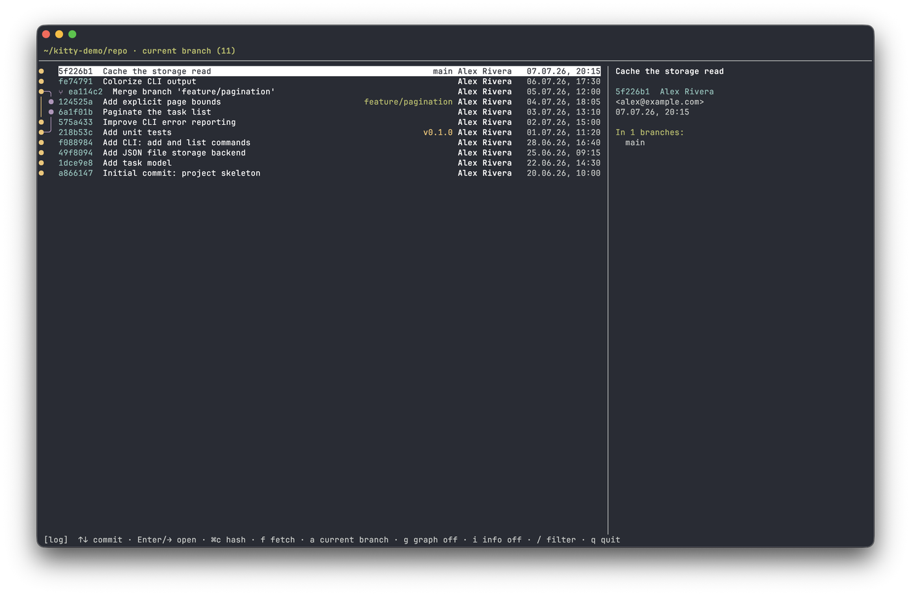

# log

[English](log.md) · [Русский](../ru/log.md)

Kitten for [kitty](https://sw.kovidgoyal.net/kitty/): a git history overlay —
a commit list screen (current branch or all branches, with a branch graph) and, for the
selected commit, its changes in a two-pane view (file tree + unified diff), like in
[review](./review.md), with syntax highlighting, search, and copy to the clipboard for
pasting into a Claude prompt.

The two-pane diff mechanics are the same base class as review; here a commit list screen,
a branch graph, and a details panel are added.



## What it can do

- **Commit list** of the current branch; the `a` toggle — show **all branches** (`--all`).
- **Branch graph** on the left (`g` toggle) — colored merge/branch lanes, as in an IDE.
- **Details panel** on the right (`i` toggle): full commit message, author, email,
  date, committer (if different), and the list of branches that contain the commit.
- **Ref labels** in the row: local branches, `origin & name` (a collapsed local+remote pair),
  remotes, and tags — each in its own color.
- **`git fetch`** straight from the overlay (`f`) — pull remotes and reread the list.
- **Copy hash** of the selected commit (`⌘c`) — for pasting into a prompt/command.
- **Lazy loading**: commits are fetched in batches as you scroll down.
- **Filter** (`/`) — by subject, short hash, and author.
- For the selected commit (`Enter` / `→`) — its changes relative to the first parent:
  file tree + unified diff with syntax highlighting, word-diff, sticky header,
  a "hunks only ↔ whole file" mode (`a`), jump between changes (`[` / `]`),
  horizontal scroll (`h` / `l`), and search (`/`, `n` / `N`).
- Russian keyboard layout for shortcuts (by key position).

The project folder and git root are determined from the `cwd` of the window the hotkey is pressed in.

## Setup

```sh
familiar enable log
```

Reload the config with `Cmd+Ctrl+,` (macOS) or restart kitty. Open with: `cmd+shift+l`.

Minimal fallback — a manual `map` in `~/.config/kitty/kitty.conf` (or an include
file):

```conf
map cmd+shift+l kitten /path/to/familiar/plugins/log.py
```

Unlike `familiar enable`, this bare map lacks the toggle-to-close behavior, the
guard against re-opening the overlay on top of itself, the Cyrillic key
duplicates, and the `cmd+c` / `cmd+shift+c` pass-through for copying inside the
overlay.

## Keys

**Commit list**

| Key | Action |
|---|---|
| `↑/↓` | navigate commits |
| `PgUp` `PgDn` | page up/down |
| `Home` / `End` | to start / end of list |
| `Enter` `→` | open commit changes |
| `⌘c` | copy hash of the selected commit |
| `f` | `git fetch` — pull remotes and reread |
| `a` | current branch ↔ all branches (`--all`) |
| `g` | branch graph on/off |
| `i` | details panel on/off |
| `/` | filter by subject / hash / author |
| `q` `Esc` | quit |

**Commit file tree** (`Enter`/`→` from the list)

| Key | Action |
|---|---|
| `↑/↓` | navigate files (diff on the right updates) |
| `g` / `G` | first / last file |
| `Enter` `Space` | collapse/expand folder |
| `→` `Tab` | go to diff |
| `u` | show/hide "noisy" folders (`.idea`, `node_modules`, …) |
| `⌘c` | copy `@path` of the file/folder |
| `←` `Esc` | back to commit list |

**Commit diff** (`→`/`Tab` from the tree)

| Key | Action |
|---|---|
| `↑/↓` | cursor over diff lines |
| `g` / `G` | to start / end of diff |
| `Enter` | on the `┈` separator — expand hidden context lines |
| `[` / `]` | previous / next change |
| `PgUp` `PgDn` | scroll the diff |
| `h` / `l` | horizontal scroll (long lines) |
| `a` | view mode: hunks only ↔ the whole file |
| `/` `n`/`N` | search the diff and jump between matches |
| `⌘c` | copy the selection (or the line under the cursor) |
| `⌘shift+c` | copy `@path#L42` (`#L42-58` for a selected range) |
| `←` `Tab` | back to the tree |
| `Esc` | clear selection/search → back to the tree → back to the list |

**Mouse**: click a commit to select, click again to open; wheel scrolls the list.
In the diff — as in review (click to place the cursor, click on `┈` to expand, select with `Shift` held).
Both panes have a scrollbar; the wheel scrolls the pane it's over, without moving the selection.

File statuses and "noisy" folders — as in [review](./review.md). Unlike review, log is
**read-only**: no comments, scopes, refresh, or opening in an editor.

## Working with Claude Code

From history it's easy to point Claude Code at a specific spot in the code:

- `⌘c` copies the **commit hash** (in the list), the **@-mention** `@path/to/file.py` of a
  file (in the tree), or the **selection / line under the cursor** (in the diff).
- `⌘shift+c` in the diff copies `@path/to/file.py#L42`, or `#L42-58` when a range of lines
  is selected with the mouse.

Paths are relative to the repository root, the way Claude Code expects them — it resolves
`@path` against the directory it was started in. Land on a line in the diff →
`⌘shift+c` → `Cmd+V` into the prompt, no need to describe where to look in words.
