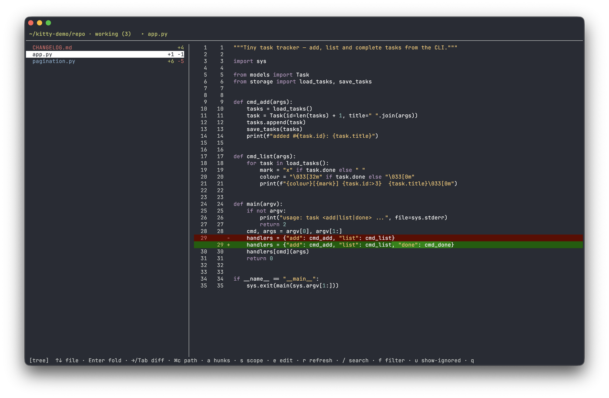
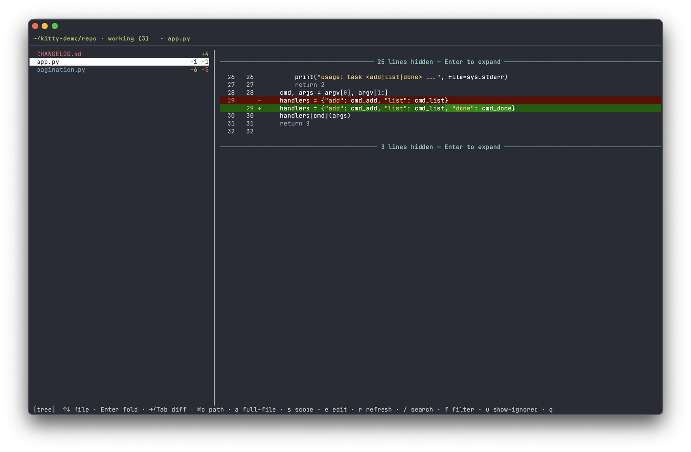

# review

[English](../en/review.md) · [Русский](review.md)

Kitten для [kitty](https://sw.kovidgoyal.net/kitty/): двухпанельный оверлей для ревью
незакоммиченных правок git. Слева — дерево изменённых файлов, справа — **unified diff** с
**подсветкой синтаксиса**, вживую при навигации.



Два режима — весь файл целиком или только изменённые hunk'и:



Плюс третий вид (`v`) — **финальный код**, как в IDE: файл целиком без знаков `+`/`−`
и без удалённых строк; правки видны маркером на полях.

## Что умеет

- **Git-скоупы** (переключатель `s`): **working** — незакоммиченное (vs `HEAD`),
  **staged** — что в индексе (vs `HEAD`), **vs \<ветка\>** — отличие от базовой ветки
  (`main`/`master`, автоопределяется). Текущий скоуп виден в шапке.
- Слева — **дерево** файлов (папки синим, файлы со статусом `M`/`A`/`D`/`R` цветом).
- Справа — **unified diff** выделенного файла: добавления зелёным `+`, удаления красным `−`,
  контекст с **подсветкой синтаксиса** уровня IDE (Pygments): функции, типы, `self`,
  декораторы, докстринги, f-строки — по расширению файла. Обновляется сразу при переходе.
- **Word-diff**: в паре удалённая/добавленная строка ярче подсвечиваются именно
  изменившиеся слова, а не вся строка.
- **Два режима просмотра** (`a`): только hunk'и (изменения с контекстом) либо **весь файл
  целиком** развёрнутым, с пометками изменений inline.
- **Финальный код** (`v`) — вид как в IDE: читаешь код таким, каким он станет после мержа.
  Ни `+`/`−`, ни удалённых строк, ни заливки внутри строк — только маркер на полях
  (`▎` зелёный — добавлено, `▎` синий — изменено, `▔` красный — здесь что-то вырезано).
  Что именно поменялось в строке, показывает unified-вид. Прыжки, комментарии,
  копирование и поиск работают как в диффе, курсор при переключении остаётся на той
  же строке.
- **Карта изменений на полосе прокрутки** справа от диффа — цветные риски показывают, где по
  файлу правки (зелёная — добавлено, синяя — изменено, красная — удалено), видно, куда листать.
- **Прыжки между изменениями** (`[` / `]`) — по блокам правок внутри диффа (в обоих режимах).
- **Статистика строк на файл** в дереве (`+добавлено −удалено`), как в IDE/GitHub.
- **Unversioned Files** — неотслеживаемые файлы собраны в отдельную группу внизу дерева,
  свёрнутую по умолчанию: куча новых файлов не хоронит правки, ради которых открыли ревью.
- **git add из дерева** (`+`) — добавить в индекс файл под курсором, целую папку или все
  неотслеживаемые разом (`+` на узле группы).
- **Откат правок** (`-`) — вернуть файл/папку под курсором к `HEAD` (и рабочее дерево,
  и индекс). Сначала спрашивает подтверждение: срабатывает только `y`. Неотслеживаемые
  файлы откатывать не к чему, поэтому они **удаляются** — в вопросе это сказано прямо.
- **Sticky-заголовок**: при скролле сверху закреплена объемлющая функция/класс.
- **Горизонтальный скролл** длинных строк (`h` / `l`).
- **Полосы прокрутки** в обеих панелях; колесо мыши скроллит ту панель, над которой курсор,
  не двигая выделение.
- **Аннотации → markdown** — комментируешь строки прямо в диффе (многострочно: `Shift+Enter`),
  по `w` все замечания собираются в markdown, копируются в буфер обмена и очищаются,
  чтобы скормить их обратно Claude («вот замечания, поправь»). Замыкает цикл ревью → правка.
- **Refresh** (`r`) — пересканировать изменения, не переоткрывая оверлей (удобно, пока Claude
  ещё правит файлы).
- **Open in editor** (`e`) — открыть текущий файл на видимой строке. Редактор выбирается
  по конфигам проекта: `.idea/` → JetBrains (PhpStorm/IDEA/PyCharm/…), `.vscode/` → VS Code,
  `.cursor/` → Cursor, `.zed/` → Zed — открывается **весь проект** с фокусом на строке,
  **оверлей при этом остаётся открытым**. Если конфигов нет — `$VISUAL`/`$EDITOR`, иначе
  `vim` в новом табе (в этом случае оверлей закрывается — терминальному редактору нужен терминал).
- **Поиск по диффу** (`/`, переходы `n` / `N`) с подсветкой совпадений.
- Фильтр дерева по имени файла (`f`), русская раскладка шорткатов.

Папка проекта и git-корень определяются по `cwd` окна, из которого нажат хоткей.

## Подключение

```sh
familiar enable review
```

Перезагрузить конфиг: `Cmd+Ctrl+,`. Открыть: `cmd+shift+r`.

Минимальный fallback — ручной `map` в `~/.config/kitty/kitty.conf` (или
include-файле):

```conf
map cmd+shift+r kitten /path/to/familiar/plugins/review.py
```

В отличие от `familiar enable`, голый `map` лишён toggle-закрытия, защиты от
повторного открытия оверлея поверх самого себя, кириллических дублей клавиш и
проброса `cmd+c` / `cmd+shift+c` для копирования внутри оверлея.

## Клавиши

| Клавиша | Действие |
|---|---|
Два фокуса: **дерево** (слева, навигация по файлам) и **дифф** (справа, курсор по
строкам для аннотаций). Переключение — `Tab` или стрелки `←` (дерево) / `→` (дифф).

**Мышь**: клик по файлу в дереве — выбрать; клик по строке диффа — поставить курсор,
**двойной клик** — открыть комментарий; клик по разделителю `┈` — раскрыть скрытые
строки. (Пока включён захват мыши, выделение текста для копирования — с зажатым `Shift`.)

**Фокус дерева**

| Клавиша | Действие |
|---|---|
| `↑/↓` | навигация по файлам (дифф справа обновляется) |
| `g` / `G` | первый / последний файл |
| `Enter` `Space` | свернуть/развернуть папку |
| `→` `Tab` | перейти в дифф (курсор по строкам) |
| `+` | `git add` файла / папки / всех Unversioned Files под курсором |
| `-` | откатить правки к `HEAD` (новые файлы удаляются); подтверждение — `y` |
| `s` | скоуп git: working → staged → vs ветка |
| `r` | пересканировать изменения (refresh) |
| `u` | показать/скрыть «шумные» папки (`.idea`, `node_modules`, `__pycache__`, …) |
| `f` | фильтр дерева по имени файла |
| `q` `Esc` | выход |

**Фокус диффа** (`→`/`Tab` из дерева; `←`/`Tab`/`Esc` — назад в дерево)

| Клавиша | Действие |
|---|---|
| `↑/↓` | курсор по строкам диффа |
| `g` / `G` | к началу / концу диффа |
| `Enter` | на разделителе `┈` — раскрыть скрытые строки контекста |
| `Enter` / `c` | комментарий к строке под курсором (пустой — удалить один) |
| `{` / `}` | прыжок к предыдущей / следующей аннотации (`●`) |
| `w` | собрать все комментарии в markdown, скопировать в буфер и очистить |
| `x` | удалить все комментарии |
| `[` / `]` | предыдущее / следующее изменение |

**Во время ввода** (комментарий / фильтр / поиск)

| Клавиша | Действие |
|---|---|
| `Enter` | сохранить (в комментарии: пустой текст — удалить его) |
| `Shift+Enter` | перенос строки — комментарии многострочные, текст переносится по словам |
| `Ctrl+W` | стереть слово перед курсором |
| `Ctrl+U` | стереть весь текст |
| `Esc` | отмена |

**Общие (в обоих фокусах)**

| Клавиша | Действие |
|---|---|
| `PgUp` `PgDn` | скролл диффа (также `Ctrl+U` / `Ctrl+D`) |
| `h` / `l` | горизонтальный скролл диффа (длинные строки) |
| `a` | режим просмотра: только hunk'и ↔ весь файл целиком |
| `v` | вид панели: unified diff ↔ финальный код (как в IDE) |
| `/` `n`/`N` | поиск по диффу и переходы по совпадениям |
| `⌘c` | скопировать: в дереве — `@путь` файла/папки, в диффе — выделение / строку под курсором |
| `⌘shift+c` | скопировать `@путь#L42` (в дереве — `@путь`) |
| `e` | открыть файл в IDE проекта (`.idea`/`.vscode`/`.cursor`/`.zed`) или `$EDITOR` |

Статусы файлов (цвет как в IDE): `A` added — зелёный, `M` modified — синий,
`D` deleted — красный, `R` renamed — голубой, `?` untracked (новый, ещё не в git) —
**красный** (файл показывается, но помечен как не добавленный в git).

Неотслеживаемые файлы собраны в группу **Unversioned Files** внизу дерева, свёрнутую по
умолчанию. `+` на узле группы добавляет в индекс сразу все; `+` на файле или папке —
только их. Подсказка `+ stage` показывается, лишь когда есть что добавлять: у уже
добавленного файла её нет.

`-` делает обратное: файл возвращается к версии из `HEAD` — и на диске, и в индексе, — а
неотслеживаемый файл удаляется с диска безвозвратно, копии в git у него нет. Ничего не
произойдёт, пока не нажмёшь `y`; `Enter`, `Esc` и любая другая клавиша отменяют.

«Шумные» IDE-папки (`.idea`, `.vscode`, `node_modules`, `__pycache__`, `dist`, `venv`,
и т.п.) скрыты по умолчанию — как в IDE; `u` их показывает (и сообщает, сколько их).
Пока они скрыты, `+` их не добавляет.

## Работа с Claude Code

### Замечания обратно в Claude

1. `Tab` — перейти в дифф, `↑/↓` — встать на строку.
2. `Enter` или `c` — написать замечание (рядом со строкой появится `●`). `Shift+Enter` —
   перенос строки; текст переносится по словам, `Ctrl+W` / `Ctrl+U` стирают слово / всё.
3. Пройтись по всем местам, в разных файлах.
4. `w` — все замечания собираются в markdown, **копируются в буфер** и очищаются из диффа:

   ```markdown
   # Review comments

   ## app/Http/Controllers/UserController.php
   - **L42** `return $user->save();`
     нет проверки прав, добавь authorize()
   ```

5. Вставить (`Cmd+V`) в чат Claude: «вот замечания по ревью, поправь».

### Пути и строки

Помимо сбора замечаний, дифф даёт быстрый способ сослать Claude Code на конкретное
место в коде. Обе клавиши кладут в буфер **@-упоминание** с путём от корня репозитория —
в том виде, какого ждёт Claude Code:

- `⌘c` — `@путь/до/файла.py` выбранного файла или `@путь/до/папки/` (в фокусе дерева);
  в диффе — **выделение / строку под курсором** как код.
- `⌘shift+c` — `@путь/до/файла.py#L42`, а при выделении диапазона мышью —
  `@путь/до/файла.py#L42-58`.

Claude Code разрешает `@путь` относительно директории, из которой запущен, — то есть это
работает, когда `claude` запущен из корня проекта. Встал на строку в диффе → `⌘shift+c` →
`Cmd+V` в промт: не нужно пересказывать словами «в файле таком-то, где-то возле функции
такой-то».

## Скоупы git (что с чем сравнивается)

Переключаются клавишей `s`, текущий виден в шапке:

| Скоуп | Файлы | «До» → «После» | Отвечает на вопрос |
|---|---|---|---|
| **working** | `git status` (+ untracked) | `HEAD:file` → файл на диске | что наменял с последнего коммита |
| **staged** | `git diff --cached` | `HEAD:file` → версия из индекса (`:file`) | что уйдёт в следующий коммит |
| **vs \<ветка\>** | `git diff <base>` | `<base>:file` → файл на диске | что нового в ветке относительно `main` |

Базовая ветка (`base`) определяется автоматически: `origin/HEAD` → `main` → `master` → `develop`.
