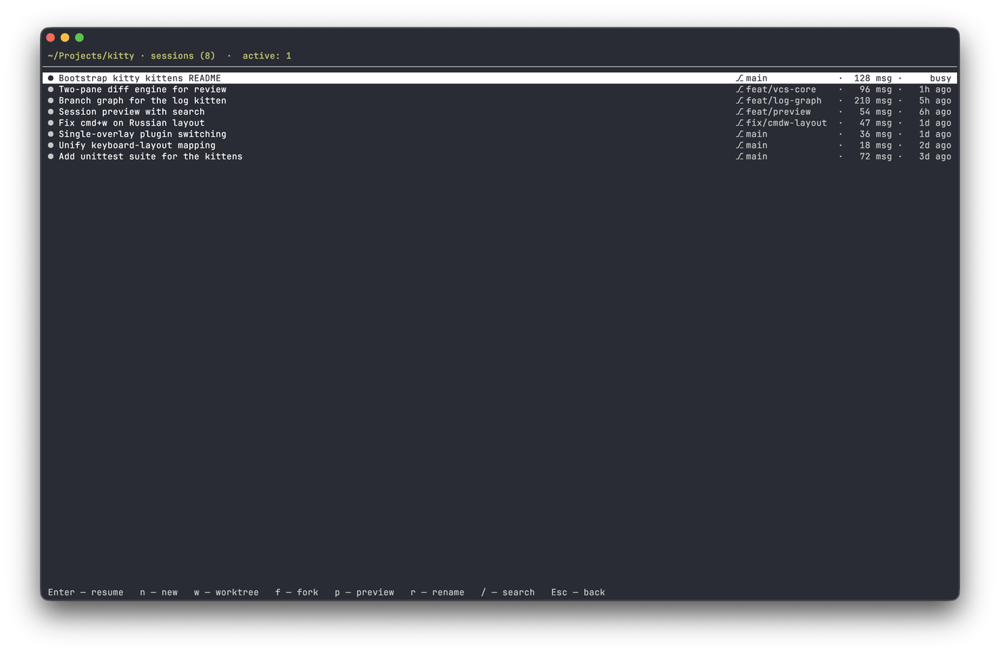
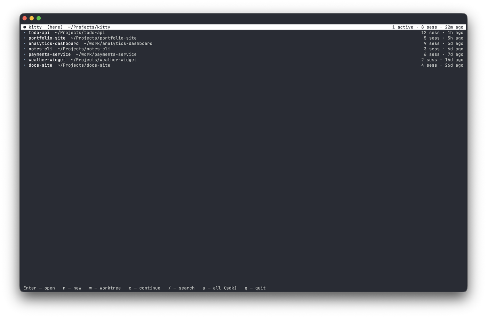
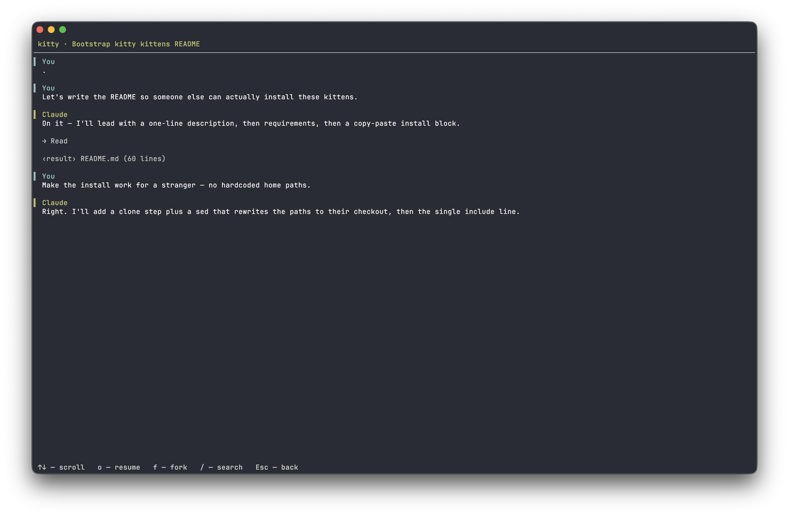

# session

[English](../en/session.md) · [Русский](session.md)

Kitten для [kitty](https://sw.kovidgoyal.net/kitty/): полноэкранный оверлей для
просмотра и управления сессиями Claude Code — прямо из терминала, по хоткею.



Три экрана — сессии проекта, список проектов и предпросмотр диалога:





## Что умеет

- **Навигация проекты → сессии.** Список проектов (`~/.claude/projects`), внутри —
  сессии выбранного проекта. Текущий проект (по `cwd` окна) помечен `(here)`.
- **Реальная активность.** Показывает, какие сессии запущены **прямо сейчас** и их
  статус (`busy` / `idle` / `waiting: permission prompt`) — источник данных
  надёжный, из реестра живых процессов, а не по времени файла. Фоновые агенты
  помечены отдельно (`◆`, `bg idle`): к ним нельзя подключиться через resume,
  пока они работают — см. [Как определяется активность](#как-определяется-активность).
- **Resume / fork.** `o` (или `Enter`) — новый таб с `claude --resume <id>` в папке
  проекта; `f` — то же, но `--fork-session` (форкнуть диалог, не трогая исходную сессию).
- **Новая сессия / continue.** `n` — новый `claude` в папке (проект или проект сессии);
  `c` (на экране проектов) — `claude --continue` (продолжить последнюю сессию проекта).
  Если окно проекта уже занято работающим `claude` — новая сессия открывается
  сплитом рядом (нужен layout `splits` из [конфига](../../config/README.ru.md); на
  «голой» kitty откроется отдельным окном — текущая сессия в любом случае не
  перекрывается, ничего не ломается).
- **Worktree.** `w` — `claude --worktree <имя>`: создать изолированный git worktree и
  запустить в нём сессию (параллельная работа, не трогая основное рабочее дерево). Имя
  спрашивается в строке ввода; пустое — Claude сгенерирует сам.
- **Предпросмотр диалога** транскриптом в стиле Claude Code: реплики (`>` / `⏺`),
  вызовы инструментов с аргументом (`⏺ Bash(git status)`), их вывод (`⎿`) с ошибками
  красным. Правки файлов — `⏺ Update(tests/x.py)` со сводкой и цветным diff'ом,
  чтение файла — `⎿ Read 402 lines`, выход из планирования — `⏺ Updated plan`
  с планом в рамке. Ответы Claude рендерятся с markdown-разметкой (жирный, курсив, инлайн-код,
  заголовки, списки, таблицы) и подсветкой синтаксиса в блоках кода. Длинный вывод
  свёрнут (`… +N lines`), `Ctrl+o` раскрывает всё. Вызовы разведки — поиск, чтение,
  обзор папки — сворачиваются в строку-сводку (`Searched for 2 patterns, read 1 file`);
  команды, правки файлов, планы и упавшие вызовы всегда видны целиком. Плюс поиск
  по тексту (`/`, переход `n` / `N` с подсветкой совпадений).
- **Переименование** сессии (`r`). Пишет запись `custom-title` в файл сессии — то же,
  что делает команда `/rename` в Claude Code, поэтому имя видно и там, и тут.
- **Фильтр списка** по названию (`/` в списке).
- Прячет шум: sdk-сессии (`entrypoint: sdk-cli`) и внутренние папки `~/.claude/…`
  скрыты по умолчанию, переключатель — `a`.
- Шорткаты работают и на **русской раскладке** (по позиции клавиши).

## Подключение

```sh
familiar enable session
```

Перезагрузить конфиг: `Cmd+Ctrl+,` (или перезапустить kitty). Открыть: `cmd+shift+s`.

Минимальный fallback — ручной `map` в `~/.config/kitty/kitty.conf` (или отдельном
include-файле):

```conf
map cmd+shift+s kitten /path/to/familiar/plugins/session.py
```

В отличие от `familiar enable`, голый `map` лишён toggle-закрытия, защиты от
повторного открытия оверлея поверх самого себя и кириллических дублей клавиш
для русской раскладки.

## Клавиши

**Мышь**: клик по строке — выбрать; повторный клик по выбранной — открыть (войти в
проект / resume сессии).

**Списки (проекты / сессии)**

| Клавиша | Экран | Действие |
|---|---|---|
| `↑/↓`, `PgUp`/`PgDn` | оба | навигация |
| `g` / `G`, `Home`/`End` | оба | в начало / конец |
| клик мышью | оба | выбрать строку · повторный клик — открыть |
| `Enter` | оба | открыть проект / resume сессии |
| `→` | сессии | предпросмотр (на проектах — открыть) |
| `n` | оба | новая сессия (`claude`) в каталоге |
| `w` | оба | worktree (`claude --worktree`) + новая сессия |
| `c` | проекты | continue (`claude --continue`) |
| `a` | проекты | показать все сессии / только `cli` |
| `o` | сессии | resume — новый таб с `claude --resume` |
| `f` | сессии | fork — resume с `--fork-session` |
| `p` | сессии | предпросмотр диалога (то же, что `→`) |
| `r` | сессии | переименовать сессию |
| `/` | оба | поиск (фильтр) по списку |
| `Esc` | оба | назад (или сбросить фильтр) |
| `q` | оба | выход |

**Предпросмотр**

| Клавиша | Действие |
|---|---|
| `↑/↓`, `PgUp`/`PgDn`, колесо мыши | скролл |
| `g` / `Home`, `G` / `End` | в начало / конец истории |
| `[` / `]` | к предыдущей / следующей реплике пользователя |
| клик по свёрнутой строке | раскрыть / свернуть (вывод, план, содержимое файла, сводку вызовов) |
| `Ctrl+o` | раскрыть весь свёрнутый вывод (повторно — свернуть) |
| перетаскивание мышью | выделение: внутри строки — куска, через строки — целых строк |
| `⌘c` | скопировать выделенное |
| `/` | поиск по тексту диалога |
| `n` / `N` | следующее / предыдущее совпадение |
| `o` | resume |
| `f` | fork (resume с `--fork-session`) |
| `Esc` `←` | назад |
| `q` | выход |

## Как определяется активность

Claude Code ведёт реестр живых процессов в `~/.claude/sessions/<pid>.json`
(`sessionId`, `cwd`, `status`, `waitingFor`, `kind`). Плагин читает его и сверяет живость
`pid` — так активные сессии определяются точно, с реальным статусом, а не по mtime.

Записи с `kind: bg` — фоновые агенты. Claude Code не даёт подключиться к живому
агенту (`claude --resume` отвечает «stop it there first to resume here»), поэтому
такие сессии помечены `◆` и статусом `bg <status>`, а `o`/`Enter` по ним не
запускают resume. Варианты: остановить агента, подключиться к нему через
`claude agents` или форкнуть диалог (`f`) — форку живой процесс не мешает.

## Источники данных

- `~/.claude/projects/<enc>/<uuid>.jsonl` — сессии (`<enc>` — путь проекта с заменой
  `/` и `.` на `-`). Заголовок берётся из `custom-title` (`/rename`), иначе `ai-title`,
  иначе первое сообщение.
- `~/.claude/sessions/<pid>.json` — реестр запущенных сессий и их статусы.
